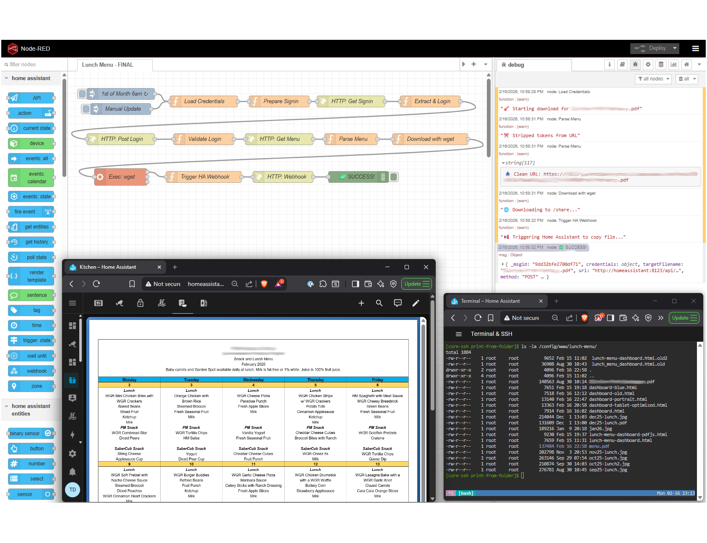

# 🍎 Automated School Lunch Menu System

[](https://opensource.org/licenses/MIT)
[](https://www.home-assistant.io/)
[](https://nodered.org/)

Automatically download and display your child's monthly lunch menu from your school's parent portal using Home Assistant and Node-RED.



---

## 📋 Table of Contents

- [Overview](#overview)
- [Features](#features)
- [System Architecture](#system-architecture)
- [Requirements](#requirements)
- [Quick Start](#quick-start)
- [Installation](#installation)
- [Configuration](#configuration)
- [Usage](#usage)
- [Technical Deep Dive](#technical-deep-dive)
- [Troubleshooting](#troubleshooting)
- [Contributing](#contributing)
- [License](#license)
- [Acknowledgments](#acknowledgments)

---

## 🎯 Overview

This project automates the monthly task of downloading lunch menus from a school parent portal and displaying them on a tablet in kiosk mode. What started as a simple automation became an interesting journey through web scraping, authentication, and debugging.

**The Problem:** Manually downloading PDF lunch menus every month is tedious.

**The Solution:** Automated system using Node-RED and Home Assistant that:
- Logs into the school portal automatically
- Downloads the current month's lunch menu PDF
- Displays it on a dashboard
- Updates automatically on the 1st of each month

---

## ✨ Features

- ✅ **Fully Automated** - Runs monthly without intervention
- ✅ **Secure Authentication** - Handles CSRF tokens and cookies properly
- ✅ **File System Integration** - Works with Node-RED and Home Assistant file systems
- ✅ **Clean Dashboard** - Minimal, tablet-friendly display
- ✅ **Error Handling** - Comprehensive logging and notifications
- ✅ **Generic & Adaptable** - Can be adapted for other school portals
- ✅ **Privacy Focused** - No personal information in shared code

---

## 🏗️ System Architecture

```
┌─────────────────────────────────────────────────────────────┐
│                        Node-RED Flow                         │
├─────────────────────────────────────────────────────────────┤
│  1. Login to school portal                                   │
│  2. Extract CSRF token                                       │
│  3. Authenticate with credentials                            │
│  4. Extract auth cookies                                     │
│  5. Access menu page                                         │
│  6. Find PDF URL                                            │
│  7. Strip signed URL parameters                             │
│  8. Download PDF with wget                                  │
│  9. Trigger Home Assistant webhook                          │
└─────────────────────────────────────────────────────────────┘
                              ↓
┌─────────────────────────────────────────────────────────────┐
│                    Home Assistant                            │
├─────────────────────────────────────────────────────────────┤
│  1. Receive webhook notification                            │
│  2. Copy PDF from /share to /config/www                     │
│  3. Send notification                                        │
└─────────────────────────────────────────────────────────────┘
                              ↓
┌─────────────────────────────────────────────────────────────┐
│                      Dashboard                               │
├─────────────────────────────────────────────────────────────┤
│  • Displays PDF using PDF.js                                │
│  • Floating refresh button                                  │
│  • Mobile-friendly design                                   │
└─────────────────────────────────────────────────────────────┘
```

---

## 📦 Requirements

### Hardware
- Home Assistant instance (any supported platform)
- Node-RED addon installed
- Tablet or device for display (optional)

### Software
- Home Assistant OS (or supervised/container)
- Node-RED addon for Home Assistant
- wget (usually pre-installed)
- Modern web browser for dashboard

### Credentials
- School portal login credentials
- School ID from portal URL

---

## 🚀 Quick Start

### 1. Clone the Repository

```bash
git clone https://github.com/YOUR_USERNAME/lunch-menu-automation.git
cd lunch-menu-automation
```

### 2. Configure Home Assistant

```bash
cp home-assistant/configuration.yaml.example config/configuration.yaml
# Edit configuration.yaml with your settings
```

### 3. Import Node-RED Flow

1. Open Node-RED
2. Import `node-red/lunch-menu-flow.json`
3. Update credentials in "Load Credentials" node
4. Update school ID in "Validate Login" node
5. Deploy

### 4. Upload Dashboard

```bash
cp dashboard/dashboard.html /config/www/lunch-menu/dashboard.html
```

### 5. Test

Click "Manual Update" in Node-RED and verify PDF downloads!

---

## 📖 Installation

Detailed installation instructions: [INSTALL.md](docs/INSTALL.md)

### Step-by-Step:

1. **[Setup Home Assistant](docs/INSTALL.md#home-assistant-setup)**
   - Configure shell command
   - Create automation
   - Add panel iframe

2. **[Configure Node-RED](docs/INSTALL.md#node-red-setup)**
   - Import flow
   - Update credentials
   - Set school ID
   - Deploy flow

3. **[Deploy Dashboard](docs/INSTALL.md#dashboard-setup)**
   - Upload HTML file
   - Configure access
   - Test display

---

## ⚙️ Configuration

### Home Assistant Configuration

**File:** `/config/configuration.yaml`

```yaml
# Shell command to copy PDF
shell_command:
  copy_lunch_menu: "cp /share/lunch-menu/menu.pdf /config/www/lunch-menu/menu.pdf"

# Panel for dashboard
panel_iframe:
  lunch_menu:
    title: "Lunch Menu"
    icon: mdi:food-apple
    url: "/local/lunch-menu/dashboard.html"
```

**File:** `/config/automations.yaml`

```yaml
automation:
  - id: copy_lunch_menu_after_download
    alias: "Copy Lunch Menu to WWW"
    trigger:
      - platform: webhook
        webhook_id: lunch_menu_downloaded
    action:
      - service: shell_command.copy_lunch_menu
      - service: persistent_notification.create
        data:
          title: "📄 Lunch Menu Updated"
          message: "New lunch menu is now available!"
```

### Node-RED Configuration

**Update these values in the flow:**

1. **Load Credentials node:**
   ```javascript
   const username = 'your-email@example.com';
   const password = 'your-password';
   ```

2. **Validate Login node:**
   ```javascript
   msg.url = 'https://your-school-portal.com/schools/YOUR_SCHOOL_ID/feeds/files';
   ```

3. **Target filename (if different):**
   ```javascript
   msg.targetFilename = "Grade-" + monthNames[new Date().getMonth()] + ".pdf";
   ```

---

## 📱 Usage

### Manual Trigger

1. Open Node-RED
2. Click blue button on "Manual Update" inject node
3. Watch debug panel for progress
4. Check `/local/lunch-menu/menu.pdf`

### Automatic Updates

- Runs automatically on the 1st of each month at 6:00 AM
- Downloads current month's menu
- Sends notification when complete

### Accessing Dashboard

**Via Home Assistant:**
- Click "Lunch Menu" in left sidebar

**Direct URL:**
```
http://homeassistant:8123/local/lunch-menu/dashboard.html
```

### Kiosk Mode

For dedicated tablets, see [KIOSK.md](docs/KIOSK.md) for setup instructions.

---

## 🔍 Technical Deep Dive

Want to understand HOW this works? Read the complete technical walkthrough:

📚 **[Technical Deep Dive](docs/TECHNICAL-DEEP-DIVE.md)**

Covers:
- Browser DevTools inspection
- Authentication flow reverse engineering
- CSRF token extraction
- Cookie handling
- PDF download troubleshooting
- File system isolation
- Complete Node-RED implementation

**Also available as:**
- [HTML Version](docs/technical-deep-dive.html) - Styled, print-friendly
- [Word Document](docs/Technical-Deep-Dive.docx) - Fully editable

---

## 🐛 Troubleshooting

### Common Issues

#### PDF Not Downloading

**Symptoms:** Flow completes but no PDF file

**Solutions:**
1. Check Node-RED debug panel for errors
2. Verify credentials are correct
3. Check school ID matches your portal URL
4. Test login manually in browser

#### Blank/Corrupt PDF

**Symptoms:** PDF downloads but won't open

**Solutions:**
1. Check if using wget (not HTTP Request node)
2. Verify authentication cookies are being passed
3. Check file size matches expected (~130KB+)
4. Run: `head -c 8 /share/lunch-menu/menu.pdf` (should show `%PDF-1.7`)

#### Dashboard Not Loading

**Symptoms:** Dashboard shows error or blank

**Solutions:**
1. Verify file is at `/config/www/lunch-menu/dashboard.html`
2. Check Home Assistant configuration.yaml
3. Restart Home Assistant
4. Clear browser cache

#### File Not Copied to /config/www

**Symptoms:** File in /share but not accessible via /local

**Solutions:**
1. Check Home Assistant automation triggered
2. Verify webhook ID matches in both Node-RED and HA
3. Test shell command manually
4. Check automation logs

For more help: [TROUBLESHOOTING.md](docs/TROUBLESHOOTING.md)

---

## 🤝 Contributing

Contributions are welcome! See [CONTRIBUTING.md](CONTRIBUTING.md)

### How to Contribute

1. Fork the repository
2. Create a feature branch (`git checkout -b feature/amazing-feature`)
3. Commit your changes (`git commit -m 'Add amazing feature'`)
4. Push to branch (`git push origin feature/amazing-feature`)
5. Open a Pull Request

### Areas for Improvement

- [ ] Support for multiple children/schools
- [ ] Email notifications with PDF attachment
- [ ] Calendar integration
- [ ] Multiple portal support (not just one type)
- [ ] Dietary restriction highlighting
- [ ] Historical menu archive

---

## 🔒 Security & Privacy

This project was designed with security and privacy in mind:

✅ **No hardcoded credentials** - Use Home Assistant secrets  
✅ **Generic code** - No personal information included  
✅ **Secure authentication** - Proper CSRF and cookie handling  
✅ **Local processing** - All data stays on your network  

**Important:** Never commit files containing:
- Your email/password
- School names
- Student information
- Authentication cookies
- API keys

See [SECURITY.md](docs/SECURITY.md) for best practices.

---

## 📄 License

This project is licensed under the MIT License - see the [LICENSE](LICENSE) file for details.

---

## 🙏 Acknowledgments

- **Home Assistant Community** - For the amazing platform
- **Node-RED Team** - For the powerful automation tool
- **PDF.js** - For reliable PDF rendering
- **Claude AI** - For debugging assistance
- **My Child's School** - For having predictable lunch menus! 🍎

---

## 📊 Project Stats


---

## 📞 Support

- 📖 [Documentation](docs/)
- 🐛 [Issue Tracker](https://github.com/YOUR_USERNAME/lunch-menu-automation/issues)
- 💬 [Discussions](https://github.com/YOUR_USERNAME/lunch-menu-automation/discussions)

---

**Made with ❤️ for busy parents who just want to see the lunch menu**

---

## 🗺️ Roadmap

### v1.0 - Current ✅
- [x] Basic authentication
- [x] PDF download
- [x] Dashboard display
- [x] Monthly automation

### v1.1 - Planned
- [ ] Multi-school support
- [ ] Email notifications
- [ ] Better error handling
- [ ] Setup wizard

### v2.0 - Future
- [ ] OCR menu parsing
- [ ] Dietary filters
- [ ] Shopping list integration
- [ ] Mobile app

---

## ⭐ Star History

If this project helped you, please consider giving it a star!

[](https://star-history.com/#YOUR_USERNAME/lunch-menu-automation&Date)
